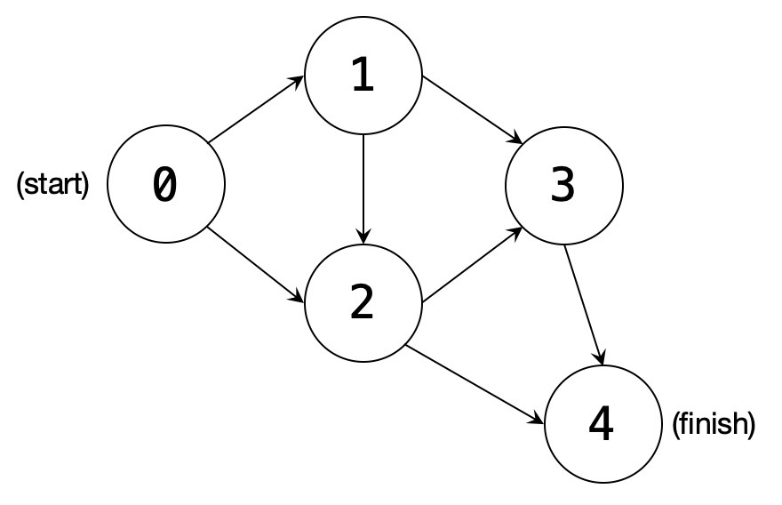

# path-enumeration
Given a graph, find and aggregate all possible paths from start to finish.

## Problem details
The solution should define a `Graph` class that is instantiated from input in a
text file and a member function `enumeratePaths()` that performs a depth-first
search and aggregates all possible paths from start to finish. The
path-enumeration function must accommodate graphs with any number of start
vertices and/or end vertices.

Below is the function signature for the path-enumeration function. Each path
is represented by an instance of `std::vector<int>` and each must be added
to the destination container.

```cpp
void Graph::enumeratePaths( std::vector< std::vector<int> > &dest );
```

## Input format
The test graphs are text files that indicate the number of vertices in the
graph, `N`, followed by an adjacency matrix. The `Graph` class's constructor
must instantiate the class from a given file.  
For example, the graph depicted below...

  

...is represented by the following text file:

```
5
0 1 1 0 0
0 0 1 1 0
0 0 0 1 1
0 0 0 0 1
0 0 0 0 0
```

## Test function
The `main()` function below tests `Graph::enumeratePaths()` function with the
two included test graphs.

```cpp
// Test program
int main()
{
  // Destination vector for paths
  std::vector< std::vector<int> > allPaths;

  // Instantiating test graph 1
  Graph graph1( "test-graphs/test1.txt" );

  // Populating vector with all possible paths
  graph1.enumeratePaths( allPaths );

  // Print results
  std::cout << "Test graph 1 paths..." << std::endl;
  for ( const std::vector<int> &p : allPaths ) {
    for ( const int v : p )
      std::cout << v << " ";
    std::cout << std::endl;
  }

  allPaths.clear();
  std::cout << std::endl;

  // Instantiating test graph 2
  Graph graph2( "test-graphs/test2.txt" );

  // Populating vector with all possible paths
  graph2.enumeratePaths( allPaths );

  // Print results
  std::cout << "Test graph 2 paths..." << std::endl;
  for ( const std::vector<int> &p : allPaths ) {
    for ( const int v : p )
      std::cout << v << " ";
    std::cout << std::endl;
  }

  return 0;
}
```

Output of test function:

```
Test graph 1 paths...
0 1 2 3 4
0 1 2 4
0 1 3 4
0 2 3 4
0 2 4

Test graph 2 paths...
0 5 4 8 9 10
0 5 4 8 10
0 5 4 9 10
0 5 7 10
0 5 8 9 10
0 5 8 10
0 6 7 10
0 5 7 11
0 6 7 11
0 6 11
1 2 10
1 3 2 10
1 3 8 9 10
1 3 8 10
1 4 8 9 10
1 4 8 10
1 4 9 10
```
